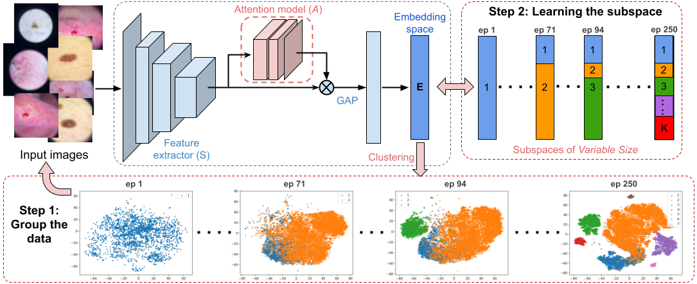

# Attention-based Dynamic Subspace Learners for Medical Image Analysis
Learning similarity is a key aspect in medical image analysis, particularly in uncovering the interpretation of anatomical data in images. Deep metric learning methods are widely used to learn such similarities in the data. Most methods use a single metric learner, which is inadequate to handle the variety of object attributes such as color, shape, or artifacts in the images. Multiple metric learners could focus on these object attributes. However, it requires a number of learners to be found empirically for each new dataset. This work presents a Dynamic Subspace Learners to dynamically exploit multiple learners by removing the need of knowing _apriori_ the number of learners and aggregating new subspace learners during training. Furthermore, the interpretability of such subspace learning is enforced by integrating an attention module into our method, providing a visual explanation of the embedding features. The benefits of our method is evaluated in the application of image clustering, image retrieval, and weakly supervised segmentation.

**Keywords:** Deep Metric Learning, Clustering, Image Retrieval and Weakly Supervised Segmentation

**TL;DR:** A novel dynamic learning strategy that overcomes the empirical search of an optimal number of subspace learners in multiple metric learners.

[[paper](https://arxiv.org/abs/2206.09068)] [[short](https://openreview.net/forum?id=IHRUUHMeXcJ)]

Overview of our proposed attention-based dynamic subspace learners:



### Dependencies
This code depends on the following libraries:

- Python >= 3.6
- SciPy
- matplotlib
- tqdm
- scikit-learn
- Pytorch
- Faiss >=1.6.1 ([Faiss-gpu](https://pypi.org/project/faiss-gpu/))

### Datasets
Please download the datasets and place in **Datasets** folder.
- [ISIC19](https://challenge.isic-archive.com/data/#2019)
- [MURA](https://stanfordmlgroup.github.io/competitions/mura/)
- [HyperKvasir](https://datasets.simula.no/hyper-kvasir/)

### Training
The model can be trained using below command:  
```
python3 experiment.py --dataset=isic --exp=dynAttn --dir=run1 --nb-clusters=1 --dyn_learner --sz-batch=32 --nb-epochs=300
```

### Testing
```
python3 run_test.py --dataset=isic --exp=dynAttn --dir=run1 --nb-clusters=1 --load-epoch=300
```

### Citation
Please cite our paper if you find this code or our work useful for your research.

```
@misc{https://doi.org/10.48550/arxiv.2206.09068,
  url = {https://arxiv.org/abs/2206.09068},
  author = {Adiga, Sukesh and Dolz, Jose and Lombaert, Herve},
  title = {Attention-based Dynamic Subspace Learners for Medical Image Analysis},
  publisher = {arXiv},
  year = {2022},
}
```

### Reference
- Divide and Conquer the Embedding Space for Metric Learning [[paper](http://openaccess.thecvf.com/content_CVPR_2019/papers/Sanakoyeu_Divide_and_Conquer_the_Embedding_Space_for_Metric_Learning_CVPR_2019_paper.pdf)][[code](https://github.com/CompVis/metric-learning-divide-and-conquer)]
- Attention-based Ensemble for Deep Metric Learning [[paper](https://arxiv.org/pdf/1804.00382.pdf)]

#### Any questions?
```
For more informations, please contact Sukesh Adiga (sukesh.adiga@gmail.com).
```

#### License
This project is licensed under the terms of the MIT license. 
